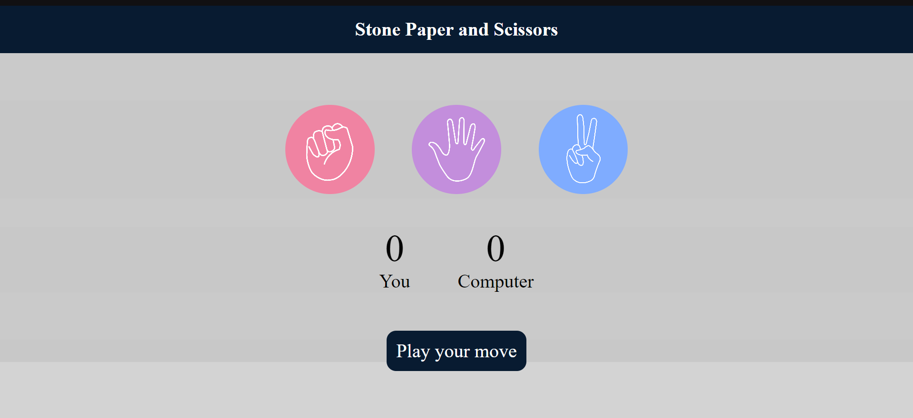

# Stone Paper Scissors Game

This is a simple implementation of the classic game "Stone, Paper, Scissors" using HTML, CSS, and JavaScript.

## How to Play

Open the `index.html` file in your web browser.
Click on the button representing your choice: Stone, Paper, or Scissors.
The computer will randomly select its choice.
The result of the game will be displayed on the screen.
Enjoy playing!

## Features

- **HTML:** Provides the structure of the game.
- **CSS:** Styles the game for a visually appealing interface.
- **JavaScript:** Implements the game logic and interactions.

## Preview

## Contributing

Contributions are welcome! If you have any ideas for improvements or new features, feel free to open an issue or submit a pull request.

